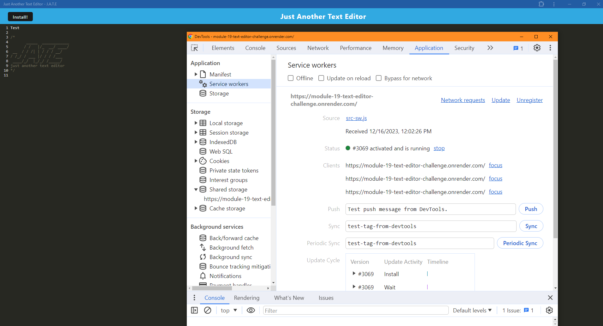

# Progressive Web Applications Challenge: Text Editor

## Description

This project was undertaken with the goal of developing a reliable and efficient text editor that runs in the browser. The motivation behind this endeavor was to create a tool that allows developers to create notes or code snippets with or without an internet connection, ensuring their work is reliably saved and accessible for later use. Throughout this project, I learned about the implementation of data persistence techniques, especially IndexedDB, and the nuances of creating a Progressive Web Application (PWA).

## Table of Contents

- [Installation](#installation)
- [Usage](#usage)
- [Credits](#credits)
- [License](#license)

## Installation

To install this project:

1. Clone the repository from GitHub.
2. Navigate to the root directory of the project in your terminal.
3. Run `npm install` to install all dependencies.
4. Execute `npm run start` to start the application.

## Usage

To use the text editor:

1. Open the application in your browser.
2. Start typing your notes or code snippets.
3. The content will automatically be saved to IndexedDB.

For a visual guide, see the screenshot of the deployed application:

Visit the deployed application [here](https://module-19-text-editor-challenge.onrender.com/).

## Credits

- Starter code provided by The EdX Coding Bootcamp.
- Assistance with code snippets and this README file by ChatGPT-4.

Special thanks to [David Gray](https://github.com/grayd500/) for development and contributions.

## License

This project is licensed under the MIT License.

## Features

- Single-page application meeting PWA criteria.
- Data persistence using IndexedDB.
- Offline functionality.
- Deployed on Render with service worker for efficient loading.

## How to Contribute

Contributions to this project are welcome. Please ensure to follow the guidelines outlined in the [Contributor Covenant](https://www.contributor-covenant.org/).

## Tests

For testing the application:

1. Navigate to the root directory in the terminal.
2. Run `npm test` to execute the test suites.

